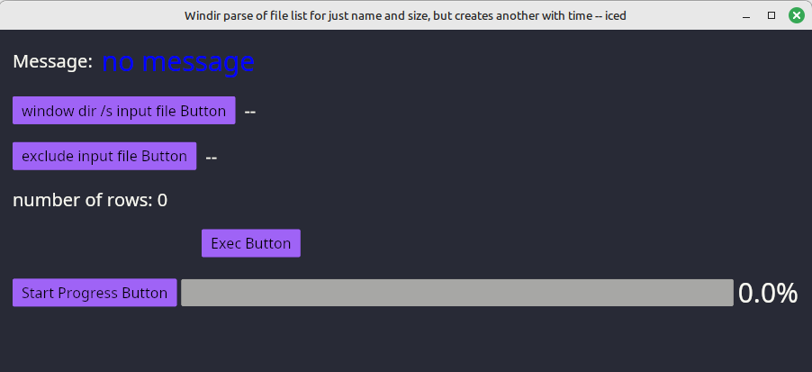

# windirparse
Rust-Iced program: reads disk list file created in windows using the following command:

under window's powershell execute:
Get-ChildItem C:\ -Force -Recurse | Select-Object FullName, LastWriteTime, Length | Export-Csv c:\temp\xxList.csv

This creates a xxList.csv file of all the files on C:\

This file is converted for input into findbackupdb.

This includes an exclude file to exclude files and directories (espeically system and temporary files)

unfortunately dir requires a lot of work to format and does not include the seconds ind the modified datetime.

This program calls winitsize01 to get the smallest monitor size

